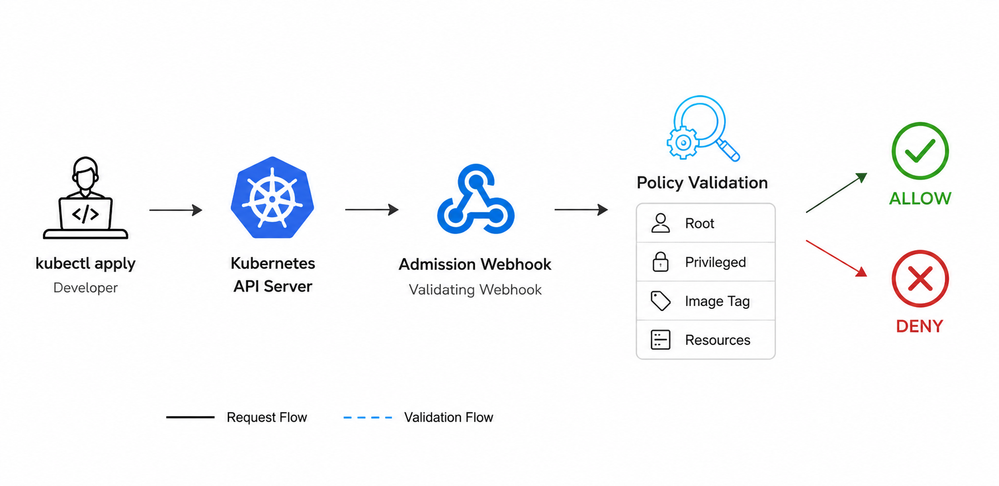
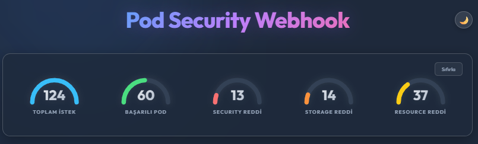
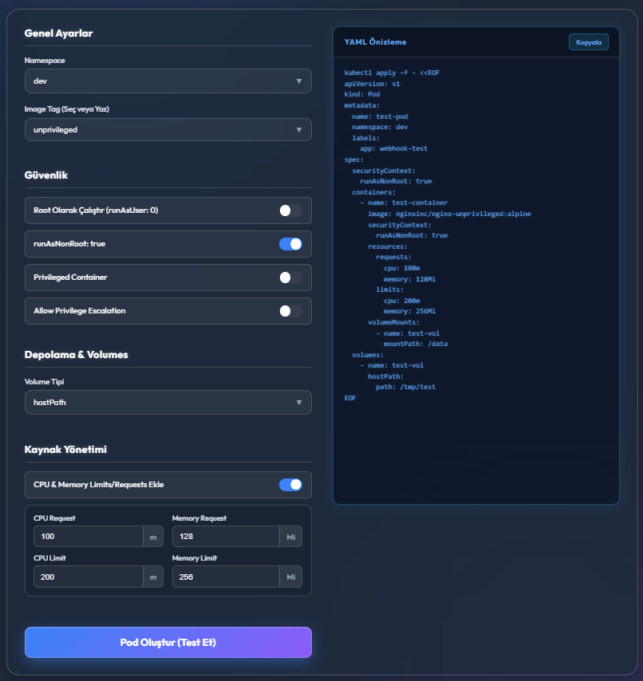
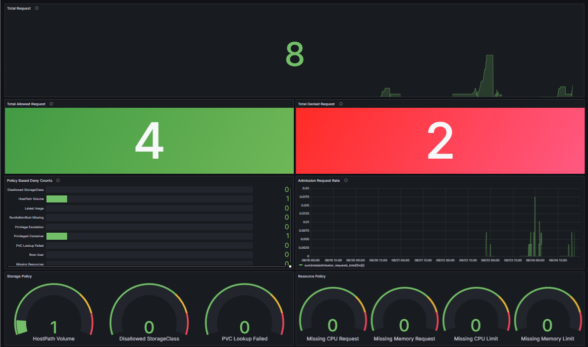

# Kubernetes Admission Webhook

Kubernetes ortamlarında Pod oluşturma isteklerini güvenlik ve kaynak politikalarına göre denetleyen bir **Validating Admission Webhook** projesidir.

Bu proje, Pod manifestleri Kubernetes API Server tarafından kabul edilmeden önce araya girerek ilgili Pod tanımını inceler ve belirlenen kurallara göre **ALLOW**, **DENY** veya **ALLOW WITH WARNING** kararı üretir.

Projenin temel amacı, Kubernetes ortamlarında hatalı veya riskli Pod yapılandırmalarının otomatik olarak engellenmesini sağlamaktır.

---

## Project Scope

Webhook aşağıdaki Pod güvenlik ve kaynak politikalarını kontrol eder:

- `latest` veya tag belirtilmemiş image kullanımı
- Root user ile container çalıştırma
- Privileged container kullanımı
- `allowPrivilegeEscalation=true` kullanımı
- `runAsNonRoot=true` zorunluluğu
- `hostPath` volume kullanımı
- İzin verilen StorageClass kontrolü
- CPU / memory request ve limit zorunluluğu

Policy davranışları namespace ortamına göre değişebilir. Örneğin `dev` ortamında bazı durumlar uyarı seviyesinde ele alınırken, `test` ortamında aynı davranış doğrudan reddedilebilir.

---

## Architecture



Genel akış şu şekildedir:

1. Kullanıcı veya UI üzerinden Kubernetes'e Pod oluşturma isteği gönderilir.
2. Kubernetes API Server, isteği Validating Admission Webhook servisine iletir.
3. Webhook, Pod manifestini policy kurallarına göre kontrol eder.
4. Uygunsa istek kabul edilir, uygun değilse reddedilir.
5. Admission kararı loglanır ve audit kayıtlarına eklenir.
6. Kullanıcı arayüzü, loglar ve dashboard üzerinden sonuçlar takip edilebilir.

---


## Policy Matrix

Webhook namespace label değerlerine göre farklı policy davranışları uygular.

| Policy | Dev | Test |
|---|---|---|
| Latest Image (`nginx:latest`) | ✅ ALLOW | ❌ DENY |
| Root User (`runAsUser=0`) | ⚠️ WARNING | ❌ DENY |
| Privileged Container | ❌ DENY | ❌ DENY |
| `allowPrivilegeEscalation=true` | ❌ DENY | ❌ DENY |
| `runAsNonRoot=true` | ✅ REQUIRED | ✅ REQUIRED |
| hostPath Volume | ⚠️ WARNING | ❌ DENY |
| Approved StorageClass | ✅ ALLOW | ✅ ALLOW |
| Unapproved StorageClass | ❌ DENY | ❌ DENY |
| CPU Requests | ✅ REQUIRED | ✅ REQUIRED |
| Memory Requests | ✅ REQUIRED | ✅ REQUIRED |
| CPU Limits | ✅ REQUIRED | ✅ REQUIRED |
| Memory Limits | ✅ REQUIRED | ✅ REQUIRED |

Namespace ortamları aşağıdaki label değerleriyle ayrılır:

```bash
kubectl label ns dev environment=dev --overwrite
kubectl label ns test environment=test --overwrite
```

---

## Storage Policy

Webhook, Pod içerisinde kullanılan volume yapılarını kontrol eder.

| Storage Usage | Dev Result | Test Result | Description |
|---|---|---|---|
| `hostPath` Volume | ⚠️ WARNING / ALLOW | ❌ DENY | Dev ortamında test ve geliştirme amacıyla uyarı verilerek kabul edilir; test ortamında node dosya sistemine doğrudan erişim riski nedeniyle reddedilir. |
| Approved StorageClass | ✅ ALLOW | ✅ ALLOW | İzin verilen StorageClass değerleri kabul edilir. |
| Unapproved StorageClass | ❌ DENY | ❌ DENY | İzin verilen listede olmayan StorageClass değerleri reddedilir. |


Birden fazla StorageClass desteklenir:

```yaml
ALLOWED_STORAGE_CLASSES=longhorn,standard
```

Bu yapı sayesinde production benzeri ortamlarda `longhorn`, Minikube geliştirme ortamında ise `standard` StorageClass kullanılabilir.

---

## Web UI

Proje içerisinde `webhook-ui` klasörü altında geliştirilen bir **Next.js** arayüzü bulunmaktadır.

UI, webhook davranışını manuel YAML yazmadan test edebilmek için hazırlanmıştır. Kullanıcı arayüzü üzerinden farklı namespace, image, securityContext, volume ve resource ayarları seçilerek test Pod manifestleri üretilebilir ve Kubernetes ortamına gönderilebilir.

### UI Features

| Feature | Description |
|---|---|
| Dashboard Cards | Toplam istek, başarılı Pod, security/storage/resource reddi gibi özetleri gösterir. |
| Pod Config Form | Namespace, image, security, volume ve resource ayarlarıyla test Pod oluşturur. |
| YAML Preview | Seçilen değerlere göre oluşacak YAML çıktısını gösterir ve kopyalama imkânı sağlar. |
| Pod List | Kubernetes üzerindeki aktif Pod’ları listeler. |
| Namespace Filter | Pod listesini namespace bazlı filtreler. |
| Pod Delete | Tekli veya çoklu Pod silme işlemi yapabilir. |
| Log Viewer | Webhook loglarını formatted veya JSON görünümünde gösterir. |

### Running UI

Locally
```bash
cd webhook-ui
npm install
npm run dev
```

Kubernetes
```bash
kubectl port-forward svc/pod-security-webhook 8443:443 -n webhook-system
```

Arayüz varsayılan olarak şu adreste çalışır:

```text
http://localhost:8443
```

---

## Backend API

Webhook backend servisi **FastAPI** ile geliştirilmiştir. Kubernetes AdmissionReview isteklerini `/validate` endpoint’i üzerinden alır.

| Endpoint | Description |
|---|---|
| `/validate` | Kubernetes API Server tarafından çağrılan admission endpointidir. |
| `/health` | Webhook uygulamasının sağlık durumunu döndürür. |
| `/health/db` | PostgreSQL bağlantı durumunu kontrol eder. |
| `/audit/summary` | Audit kayıtlarından özet istatistik üretir. |
| `/docs` | Swagger/OpenAPI dokümantasyonunu açar. |

Swagger UI için:

```bash
kubectl port-forward svc/pod-security-webhook 8443:443 -n webhook-system
```

```text
https://localhost:8443/docs
```

---

## Monitoring and Audit

Monitoring katmanı projenin ana amacı değil, webhook kararlarının doğrulanması için destekleyici bir katmandır.

| Component | Usage |
|---|---|
| Prometheus | Admission request, allow, deny ve policy bazlı metrikleri toplar. |
| Grafana | Webhook kararlarını dashboard ve alert kurallarıyla görselleştirir. |
| PostgreSQL | Admission kararlarını kalıcı audit log olarak saklar. |

Grafana için:

```bash
kubectl port-forward svc/grafana-service 3000:3000 -n monitoring
```

```text
http://localhost:3000
```

---

## Audit Logging

Webhook tarafından verilen admission kararları PostgreSQL üzerinde saklanır.

Saklanan temel alanlar:

| Field | Description |
|---|---|
| `namespace` | Pod’un oluşturulmak istendiği namespace |
| `pod_name` | Pod adı |
| `image` | Kullanılan container image bilgisi |
| `decision` | allow, deny veya allow_with_warning |
| `policy` | Kararın ilişkili olduğu policy tipi |
| `reason` | Kararın açıklaması |
| `environment` | dev veya test ortam bilgisi |
| `created_at` | Kayıt zamanı |

Örnek audit kaydı:

```text
id | namespace | pod_name              | image      | decision | policy   | reason
---|-----------|----------------------|------------|----------|----------|------------------------------
2  | test      | test-privileged-deny | nginx:1.25 | deny     | security | Privileged container: nginx
```

---

## Technology Stack

| Layer | Technology |
|---|---|
| Backend | Python, FastAPI |
| Frontend | Next.js, React, TypeScript |
| Containerization | Docker |
| Orchestration | Kubernetes, Minikube |
| Admission Control | Kubernetes Validating Admission Webhook |
| Database | PostgreSQL |
| Monitoring | Prometheus, Grafana |
| API Documentation | Swagger / OpenAPI |

---

## Secreenshots

### Webhook UI Dashboard



### Pod Configuration Form



### Grafana Dashboard



---